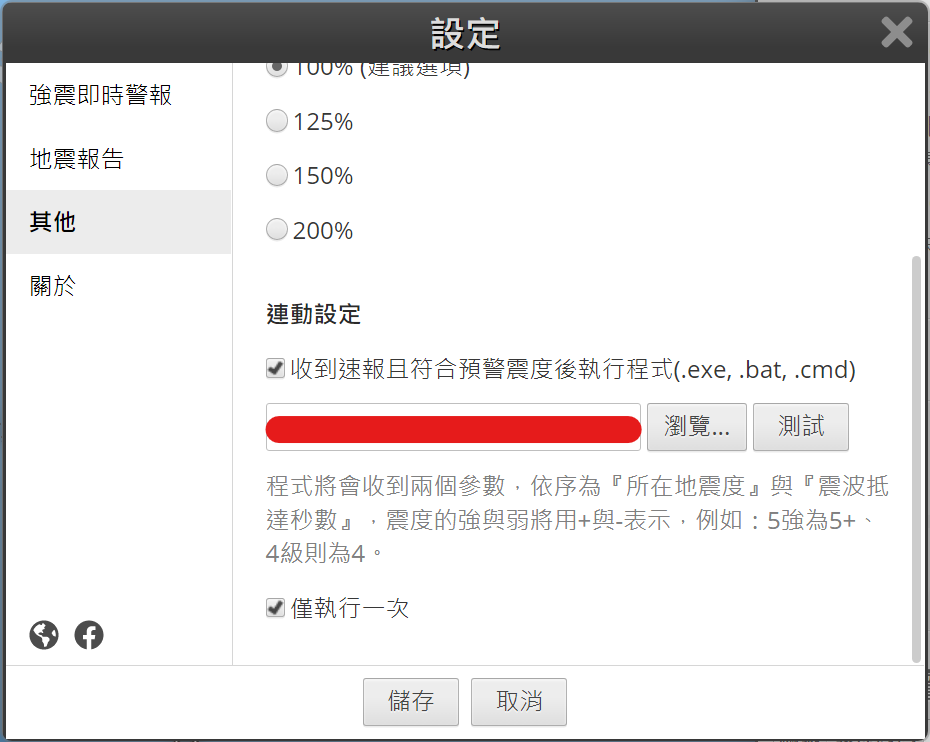

# Telegram 地震串接 Userbot

## 依賴 [地牛 Wake up!](https://eew.earthquake.tw/)

- 安裝請洽地牛官網

## 安裝及設定

- 準備環境
    - [Python](https://www.python.org/) >= 3.10
    - [Pyrogram](https://docs.pyrogram.org/intro/install) >= 2.0.62
    - Telegram API ID, API HASH [點此申請](https://my.telegram.org/auth)
- 安裝依賴
    - `pip install -r requirements.txt`
    - 修改 `settings.py` 裡面的設定符合需求

> Windows 環境需要修改 `run.bat` 確保 `python.exe` 位置正確

- 地牛設定
    - 連動設定
      
        - 劃紅線的地方請指向 `run.sh | run.bat` 的路徑
    - 其他設定
        - 依照需求進行設定
- 執行
    - 執行 `python server.py` 啟動伺服器
    - 顯示 `Script started.` 即表示已經啟動，等待接收觸發到的地震資訊
